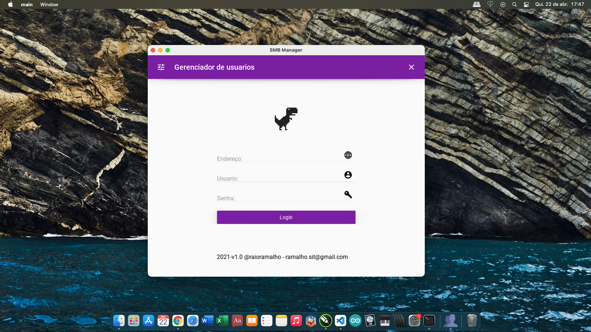

# SMB-MANAGER

Aplicação feita em python e kivymd, para windows, linux, android e osx.

#Requerimentos:

Kivy==2.0.0

kivymd==0.104.1

paramiko==2.7.2

#Funcionalidades:

Gerenciar usuários unix 

Gerenciar usuários smb

Gerenciar senhas unix & smb

Gerenciar grupos unix & smb

#Próximas atualizações:

Gerenciar usuários LDAP

Gerenciar senhas LDAP

Gerenciar grupos LDAP

#1408ac1c59ff8d2d4d4514ce1132aa5e3aa2cfe5  main.py

</img>
